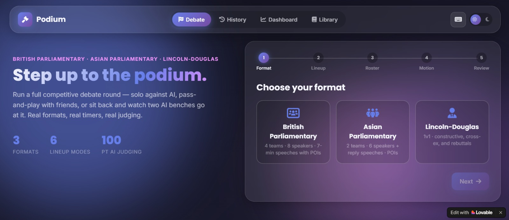

<div align="center">

# 🎙️ Podium — AI Debate Coach

**A full-format competitive debate trainer.** Run British Parliamentary, Asian
Parliamentary, or Lincoln-Douglas rounds solo against AI, pass-and-play with
friends, or hands-off as an AI-vs-AI demo — with real timers, live Points of
Information, cross-examination, text/voice/video input, AI judging out of
100, a Best Speaker award, and a full post-round critique.


</div>

<p align="center">
  
  <br/>
  <em>📸 Placeholder — replace with a screenshot of the setup screen (see <a href="#-screenshots">Screenshots</a>)</em>
</p>

---

## 📑 Table of Contents

1. [Overview](#-overview)
   -  [Live Demo](#-live-demo)
   - [The Problem It Solves, and For Whom](#the-problem-it-solves-and-for-whom)
3. [Screenshots](#-screenshots)
4. [Feature Summary](#-feature-summary)
5. [Debate Formats](#-debate-formats)
   - [British Parliamentary](#1️⃣-british-parliamentary-bp)
   - [Asian Parliamentary](#2️⃣-asian-parliamentary)
   - [Lincoln-Douglas](#3️⃣-lincoln-douglas-ld)
6. [In-App Format Guide](#-in-app-format-guide)
7. [Lineup Modes — Who's Speaking](#-lineup-modes--whos-speaking)
8. [Input Methods](#️-input-methods)
   - [Text](#-text-input)
   - [Voice](#-voice-input)
   - [Video](#-video-input)
9. [Live Debate Mechanics](#-live-debate-mechanics)
   - [Timer System](#⏱️-timer-system)
   - [Points of Information (POIs)](#-points-of-information-pois)
   - [Cross-Examination (LD)](#-cross-examination-lincoln-douglas-only)
   - [AI Voice Delivery](#-ai-voice-delivery)
   - [Live Fallacy Detector](#-live-fallacy-detector)
   - [Practice Mode](#-practice-mode)
10. [AI Judging & Scoring](#-ai-judging--scoring)
   - [Example: the actual judging system prompt](#example-the-actual-judging-system-prompt)
11. [Critique Session](#-critique-session)
12. [History, Dashboard & Library](#-history-dashboard--library)
13. [Export & Share](#-export--share)
14. [Themes & Accessibility](#-themes--accessibility)
15. [Tech Stack](#️-tech-stack)
16. [Project Structure](#-project-structure)
17. [Installation & Setup](#️-installation--setup)
18. [Roadmap](#️-roadmap)
19. [License](#-license)

---


## 📖 Overview

**Podium** turns a browser into a full competitive-debate room. It supports
three real adjudicated formats, lets any mix of humans and AI fill the
speaking roster, accepts speeches as typed text, live voice-to-text, or
recorded video, and closes every round with AI adjudication: numeric scores
out of 100 for every speaker, a declared result, a **Best Speaker** award, and
a coach-style critique session.

It was built as a single Node/Express backend (which talks to the Google
Groq API) plus a **framework-free** HTML/CSS/JS frontend — no build step, no
bundler, just three files (`index.html`, `style.css`, `script.js`) that a
browser can run directly.

## Live Demo

**Live URL:** [https://debate-coach-pro.lovable.app](https://debate-coach-pro.lovable.app)

### The problem it solves, and for whom

Competitive debaters need two things to improve: **an opponent who actually
pushes back**, and **an adjudicator who scores them honestly against the real
rules of their format**. Both are in short supply — coaches have limited
hours, practice partners aren't always free, and BP/Asian Parliamentary/LD
each have their own roles, timings, and judging conventions that most casual
practice tools ignore entirely (most "debate with AI" apps only do a generic
1-on-1 argument, not an actual 8-speaker BP round with POIs and a real 1st–4th
bench ranking).

**Podium is for:** competitive debate students and teams preparing for
tournaments, debate coaches who want a between-session practice tool for
their students, and debate club members who don't always have a full room of
people available to run a proper round. It lets one person run an entire
BP round solo (AI fills every other seat), or a small group fill in just the
seats they have people for — and either way, the round is judged and
critiqued exactly as a real adjudicator would.

## Live Demo

**Live URL:** [https://debate-coach-pro.lovable.app](https://debate-coach-pro.lovable.app)

---


## 📸 Screenshots

Here is what the application looks like in action.

| | |
|---|---|
| **Setup — Choose a Format** <br/>  | **Line-up** <br/>  |
| **Ready to Debate** <br/>  | **Motion** <br/>  |
| **Prep Time** <br/>  | **Point of Information** <br/>  |
| **Cross-Question (LD)** <br/>  | **Best Speaker** <br/>  |
| **Positions Announcement** <br/>  | **Detailed Critique** <br/>  |
| **Speaker Scores** <br/>  | **Ranking of Speakers** <br/>  |
| **Key Moments** <br/>  | **Fallacy Library** <br/>  |
| **Dashboard** <br/>  | **History** <br/>  |
| **Light Mode** <br/>  | **Select Number of Human Speakers** <br/>  |
| **Export Result** <br/>  | |

---

## ✨ Feature Summary

| Category | What's included |
|---|---|
| **Formats** | British Parliamentary, Asian Parliamentary, Lincoln-Douglas — correct roles, speaking order, and timing for each |
| **Guide** | A dedicated in-app **Guide tab** — full rules, team structure, and speaker responsibilities for all 3 formats, a breakdown of each format's Q&A session (POIs or cross-examination), and a built-in **AI chatbot** to ask follow-up questions |
| **Lineups** | All-Human, All-AI (demo), Mixed (pick exact seats) for BP/Asian; Human-vs-Human, Human-vs-AI, AI-vs-AI for LD |
| **Input** | Typed text, live voice-to-text, or recorded video (with automatic transcription running underneath) |
| **Live tools** | Circular countdown timer, Points of Information, cross-examination (LD), live fallacy highlighting, AI text-to-speech delivery, AI-suggested arguments (practice mode) |
| **Judging** | Every speaker scored out of 100 (Content 40 / Strategy 30 / Style 20 / Rebuttal 10), Best Speaker award, full 1st–4th team podium for BP |
| **Critique** | Overall analysis, per-speaker feedback, key moments, actionable tips, body-language notes from video |
| **Tracking** | Local round history with filters, a dashboard with score-progression and breakdown charts, a per-role performance tracker |
| **Extras** | Searchable fallacy glossary, transcript export, printable PDF results, shareable result links, light/dark theme, full keyboard shortcuts |

---

## 🏛️ Debate Formats

Podium implements three distinct, correctly-modeled adjudicated formats —
each with its own roles, speaking order, timing, and judging logic. The
format you pick in Step 1 of setup drives everything downstream: how many
seats exist, what the roster editor shows you, how the timer behaves, and
how results are presented.

### 1️⃣ British Parliamentary (BP)

The most complex format: **4 independent teams, 8 speakers.**

| Bench | Team | Speakers |
|---|---|---|
| Opening Government (OG) | 1st Government bench | Prime Minister (PM), Deputy Prime Minister (DPM) |
| Opening Opposition (OO) | 1st Opposition bench | Leader of Opposition (LO), Deputy Leader of Opposition (DLO) |
| Closing Government (CG) | 2nd Government bench | Member of Government (MG), Government Whip (GW) |
| Closing Opposition (CO) | 2nd Opposition bench | Member of Opposition (MO), Opposition Whip (OW) |

**Speaking order** (strictly enforced, one seat at a time):
`PM → LO → DPM → DLO → MG → MO → GW → OW`

- **Speech length:** 7:00, with a warning bell at 6:30.
- **Points of Information:** open from 1:00 to 6:00 of each speech, 15 seconds each.
- **Judging is NOT Government-vs-Opposition.** BP ranks all **four benches
  independently, 1st through 4th** — a Closing team can easily outrank an
  Opening team on the *same* side. Podium's results screen reflects this
  with a literal **podium bar chart** (see [AI Judging & Scoring](#-ai-judging--scoring)).

### 2️⃣ Asian Parliamentary

A more compact **2-team, 6-speaker** format, closer to a classic debate.

| Team | Speakers |
|---|---|
| Government | Prime Minister (PM), Deputy Prime Minister (DPM), Government Whip (GW) |
| Opposition | Leader of Opposition (LO), Deputy Leader of Opposition (DLO), Opposition Whip (OW) |

**Speaking order:** `PM → LO → DPM → DLO → GW → OW`, followed by two **reply
speeches** (summary-only, no new arguments): **Opposition Reply → Government
Reply.**

- **Main speech length:** configurable in setup — 5:00 or 7:00.
- **Reply speeches:** 4:00 each, delivered by whichever seat you assign (LO or PM by convention).
- **Points of Information:** same 15-second POIs as BP, open during main speeches.
- **Judging:** a single winning team is declared (Government or Opposition), since this is a genuine two-side contest.

### 3️⃣ Lincoln-Douglas (LD)

A **1-on-1** debate centered on values, ethics, and philosophy — between an
**Affirmative** and a **Negative** — using the standard 7-stage structure:

| Stage | Speaker | Duration | Type |
|---|---|---|---|
| Affirmative Constructive (AC) | Affirmative | 6:00 | Constructive |
| Cross-Examination | Negative questions Affirmative | 3:00 | Q&A |
| Negative Constructive (NC) | Negative | 7:00 | Constructive |
| Cross-Examination | Affirmative questions Negative | 3:00 | Q&A |
| First Affirmative Rebuttal (1AR) | Affirmative | 4:00 | Rebuttal |
| Negative Rebuttal (NR) | Negative | 6:00 | Rebuttal |
| Second Affirmative Rebuttal (2AR) | Affirmative | 3:00 | Rebuttal |

- **No whip speakers, no closing teams** — just the two debaters, each
  arguing for themselves throughout. The Affirmative speaks first *and*
  last (AC and 2AR).
- **No POIs** in LD — cross-examination replaces them, run as a dedicated
  back-and-forth modal where the questioner and answerer can be any mix of
  human/AI (see [Cross-Examination](#-cross-examination-lincoln-douglas-only)).
- **Judging:** a single winning side (Affirmative or Negative) is declared.


## 👥 Lineup Modes — Who's Speaking

Step 2 of setup ("Who's speaking?") controls exactly who fills each seat.
Options differ by format because BP/Asian have multiple seats per side while
LD is strictly 1-vs-1:

| Format | Modes available |
|---|---|
| **BP / Asian** | **All Human** — everyone speaks, AI only moderates & judges · **All AI (demo)** — sit back and watch every seat debate itself · **Mixed** — choose *exactly* how many seats are human, then assign which specific seats in the roster editor |
| **Lincoln-Douglas** | **Human vs Human** — pass-and-play, AI judges only · **Human vs AI** — you debate a configurable AI opponent (choose which side you play) · **AI vs AI** — watch two AI debaters go head-to-head |

Step 3 (**Roster**) then lets you name every human seat and gives every AI
seat a persona name — full control, seat by seat, rather than a rigid
all-or-nothing switch.

---

## 🎤️ Input Methods

Every speaking turn — human or AI — can be delivered through any of three
input modes, switchable via tabs above the speech composer.

### ⌨️ Text Input

- A plain textarea with a **live word counter**.
- Text is scanned in the background (debounced ~350ms) against a **local
  regex-based fallacy detector** — matches are underlined inline and shown
  as colored chips (see [Live Fallacy Detector](#-live-fallacy-detector)).
- `Enter` sends the speech; `Shift+Enter` inserts a newline.

### 🎙️ Voice Input

- Uses the browser's native **Web Speech API** (`SpeechRecognition`) for
  continuous, real-time speech-to-text.
- Transcribed text streams directly into the same composer textarea (so it
  benefits from the same live word count and fallacy highlighting as typed
  text).
- Best supported in Chrome/Edge; Firefox and Safari have limited support.

### 📹 Video Input

- Requests camera + microphone access (`getUserMedia`) and shows a live
  preview.
- **Start recording** kicks off three things simultaneously:
  1. A `MediaRecorder` capturing the full video clip (available as an
     in-session replay link).
  2. **Automatic live transcription** (the same voice engine as Voice Input)
     running underneath, so you don't have to type *and* perform at once.
  3. Periodic still-frame capture (up to 4 frames across the speech), sent
     to a Groq **vision** model afterward for an AI read on **posture, eye
     contact, gestures, and confidence** — this feeds directly into the
     [Critique Session](#-critique-session).

---

## 🎯 Live Debate Mechanics

### ⏱️ Timer System

- A large **SVG circular countdown** with a digital readout, color-coded:
  🟢 normal → 🟡 warning (final ~30–90 seconds, format-dependent) → 🔴 danger
  (final 30 seconds, with a pulsing animation).
- An optional **15-minute prep timer** runs before the round starts (skippable).
- AI turns show the *same* timer for consistency, while the AI's text/speech
  reveals at a natural pace underneath.

### 🙋 Points of Information (POIs)

Available in BP and Asian Parliamentary during the POI window of any main speech:

1. Click **Raise POI** — a modal lists every seat on the *opposing* bench.
2. Pick who's asking: a **human** asker types their own point; an **AI**
   asker has one generated on the fly from the speech-in-progress.
3. The current speaker — human or AI — can **accept and reply**, or
   **decline**. AI speakers decide this themselves via the judge model.
4. Every offered POI (accepted or declined) is logged into the transcript
   and visible to the AI judge afterward.
5. Capped at 3 POIs per speech to keep rounds moving.

### 🗣️ Cross-Examination (Lincoln-Douglas only)

LD swaps POIs for two dedicated 3-minute **cross-examination** blocks. A
focused modal opens showing who's questioning whom; the pair can trade as
many question/answer exchanges as time allows — each side can be human
(types their question/answer) or AI (generates one automatically) in any
combination, and either debater can end the block early.

### 🔊 AI Voice Delivery

Toggle **"AI speakers deliver their speeches aloud"** in setup (on by
default) and every AI turn is read aloud using the browser's speech
synthesis engine in real time, with the on-screen text revealing in sync at
a natural spoken pace. A **skip** button is always available to jump
straight to the full text.

### 🚩 Live Fallacy Detector

A lightweight, local pattern-matching engine (backed by `data/fallacyPatterns.json`
and a full glossary in `data/fallacies.json`) scans speech text as it's typed
or transcribed:

- Matches are **underlined inline** in the composer and shown as **colored
  chips** (mild = amber, severe = red).
- A running **Fallacy Feed** panel logs every flag through the round, per speaker.
- A deeper, non-blocking **AI-backed pass** (via Groq) runs after each
  speech is sent, catching subtler cases the regex patterns miss.
- The full glossary — every fallacy the detector knows, with definitions,
  examples, and how to fix them — is browsable and searchable in the
  [Library tab](#-history-dashboard--library).

### 💡 Practice Mode

An optional toggle for human speakers: an **"Ask AI for a suggestion"**
button appears next to the composer, returning three short, tactical
argument or rebuttal ideas tailored to your role, side, and what's already
been said in the round.

---

## 🧮 AI Judging & Scoring

When the round ends, the full transcript (every speech, every POI/cross-ex
exchange) is sent to Groq for adjudication. Every speaker is scored **out of
100**, broken down into four weighted categories:

| Category | Weight | What it measures |
|---|---|---|
| **Content** | 40% | Argument quality, evidence, relevance to the motion |
| **Strategy** | 30% | Structure, prioritization, engagement with the room |
| **Style** | 20% | Delivery, clarity, persuasiveness |
| **Rebuttal** | 10% | How well opposing points were answered |

The backend **clamps and validates every sub-score itself** (0–40 / 0–30 /
0–20 / 0–10) rather than trusting the raw model output, so totals are always
mathematically consistent.

**Results are format-aware:**

- **British Parliamentary** → the app computes an **authoritative 1st–4th
  team ranking** by summing each bench's two speaker totals *server-side*
  (never trusted from the model's own arithmetic), because BP's four benches
  must be ranked independently — a Closing team can rank above an Opening
  team on the same side. This is shown as a literal **podium bar chart**.
- **Asian Parliamentary / Lincoln-Douglas** → a single winning team/side is
  declared, since these are genuine two-side contests.

Every round also crowns a **🏆 Best Speaker** — the single highest-scoring
speaker regardless of team — shown with their score and the judge's written
reasoning, plus a full ranked list of every speaker with medal icons and
animated score bars.

### Example: the actual judging system prompt

This is the real prompt (from `utils/prompts.js`, function `buildJudgePrompt`)
sent to Groq at the end of every round, rebuilt fresh each time with the
motion, roster, and full transcript substituted in:

```text
You are a rigorous, fair competitive debate adjudicator judging a
{FORMAT} round. {FORMAT-SPECIFIC NOTE — e.g. for BP: "IMPORTANT: British
Parliamentary has FOUR INDEPENDENT teams (Opening Government, Opening
Opposition, Closing Government, Closing Opposition) competing for 1st,
2nd, 3rd, and 4th place — it is NOT a two-side Government-vs-Opposition
contest. Judge each bench on its own merits and be prepared to rank a
Closing team above an Opening team on the same side, or vice versa."}

Score every speaker out of 100 using this exact weighting: Content 40%
(argument quality, evidence, relevance to the motion), Strategy 30%
(structure, prioritization, engagement with the round), Style 20%
(delivery, clarity, persuasiveness of the writing/register), Rebuttal 10%
(how well they answered opposing points). Each sub-score should be given
out of its own weighted maximum so they sum to the total out of 100.

Be discriminating — do not give everyone the same score; reward genuinely
stronger speeches and penalize weak or repetitive ones. Determine the
single Best Speaker of the round (highest total score).

Respond with ONLY strict JSON matching this shape:
{
  "speakerScores": [ { "id": string, "content": number, "strategy": number,
    "style": number, "rebuttal": number, "total": number,
    "oneLineVerdict": string } ],
  "winningTeamReason": string,
  "bestSpeakerId": string,
  "bestSpeakerReason": string
}
```

Two things worth calling out about how this is used:
1. **The format-specific note is injected dynamically** — the app tells the
   model explicitly that BP is a 4-way bench ranking, not a 2-side contest,
   because that's the single most common mistake a generic debate judge
   (human or AI) makes with this format.
2. **The backend never trusts the model's arithmetic.** Every sub-score is
   clamped server-side to its correct range, and for BP, the 1st–4th team
   ranking is *computed independently* from the validated per-speaker totals
   — the model's JSON only supplies the individual speaker scores and the
   written reasoning, never the final ranking math. See `server.js` →
   `POST /api/judge`.

The **speech-generation**, **POI**, **cross-examination**, and **critique**
prompts follow the same pattern (strict JSON output where structured data is
needed, plain text where it isn't). See `utils/prompts.js` in the repo for
all of them in full.

---

## 🗣️ Critique Session

Framed as a **7-minute post-round debrief** (with an ambient countdown you
can skip), the critique screen presents:

- **Overall analysis** — 3–5 sentences on what worked and what didn't across the room, revealed with a typewriter effect.
- **Per-speaker feedback** — strengths, delivery, rebuttal work, and one concrete area to improve, for every speaker.
- **Key moments** — best argument, best rebuttal, a turning point, and a missed opportunity, each labeled and explained.
- **Improvement tips** — 4–6 specific, actionable suggestions.
- **Video / body-language notes** — if any speaker recorded video, the AI's read on their posture, eye contact, gestures, and confidence appears here.
- **A restated scoreboard** — every speaker's score out of 100, plus a dedicated **👑 Best Speaker** banner with the judge's reasoning, so the top performance is never buried in a wall of text.

---

## 📊 History, Dashboard & Library

- **History** — every finished round is saved to the browser's local
  storage. Filter by format, sort by recency or score, and click into any
  past round to revisit its full results screen.
- **Dashboard** — stat cards (rounds debated, your average score, Best
  Speaker awards, favorite format), a **score-progression line chart**
  across your last 12 rounds, a **score-breakdown bar chart** (average % in
  each of the four judging categories), and a **role-by-role performance
  tracker** (e.g. "as DPM: 78/100 avg across 4 rounds").
- **Library** — a searchable glossary of every fallacy the live detector
  recognizes, with definitions, examples, and fixes.

---

## 📤 Export & Share

- **Export transcript** — downloads the full round (every speech, every
  POI, final scores, and critique) as a plain `.txt` file.
- **Print / Save as PDF** — a print-optimized stylesheet strips away chrome
  (nav, buttons, backgrounds) so the browser's native print-to-PDF produces
  a clean results document.
- **Share result** — generates a link to a read-only results view via the
  backend (stored server-side in memory — see [Known Limitations](#️-known-limitations)).

---

## 🎨 Themes & Accessibility

- **Dark mode** (default) and **light mode**, toggled from the top bar, with
  a smooth animated transition and a persisted preference.
- Fully **responsive** down to mobile widths (touch-friendly 44px+ tap targets).
- A glass-morphism visual language throughout: frosted panels, gradient
  accents, and animated backgrounds, built around Poppins (headings) and
  Inter (body) type.

---

## 🛠️ Tech Stack

| Layer | Technology |
|---|---|
| Frontend | Vanilla HTML5, CSS3, JavaScript (ES2022) — **no framework, no build step** |
| Charts | [Chart.js](https://www.chartjs.org/) (Dashboard tab) |
| Icons | [Font Awesome](https://fontawesome.com/) |
| Fonts | Google Fonts — Poppins & Inter |
| Backend | Node.js + [Express](https://expressjs.com/) |
| AI | [Groq API](https://console.groq.com/) — Llama 3.3 70B (text) & Llama 3.2 11B Vision (body-language frame analysis) |
| Browser APIs | Web Speech API (voice input + AI TTS), MediaRecorder + getUserMedia (video), Canvas (confetti + frame capture) |
| Storage | Browser `localStorage` (history), in-memory `Map` (shared results) |

---

## 📁 Project Structure

```
podium/
├── server.js                  # Express app + every API route
├── package.json
├── .env.example                # Copy to .env and add your Groq key
├── vercel.json                 # One-command Vercel deploy config
├── utils/
│   ├── groq.js                 # Groq API wrapper (text + vision)
│   └── prompts.js              # Prompt builders for every AI touchpoint
├── data/
│   ├── formats.json            # Roles / speaking order / timing per format
│   ├── motions.json            # Random motion bank
│   ├── fallacies.json          # Fallacy glossary (Library tab)
│   └── fallacyPatterns.json    # Regex patterns behind the live detector
├── public/
│   ├── index.html              # Every screen: setup, prep, debate, results, critique, history, dashboard, library
│   ├── style.css                # The entire glass-morphism design system
│   └── script.js                # All frontend logic
└── screenshots/                # 👉 drop your screenshots here (see above)
```
## ⚙️ Installation

### Prerequisites

Before getting started, make sure you have:

- **Node.js** (v18 or later recommended)
- **npm** (comes with Node.js)
- A **Groq API key**

### 1. Clone the repository

```bash
git clone https://github.com/YOUR_USERNAME/podium.git
cd podium
```

### 2. Install dependencies

```bash
npm install
```

### 3. Configure environment variables

Create a `.env` file in the project root.

```env
GROQ_API_KEY=your_groq_api_key_here
PORT=3000
```

Replace `your_groq_api_key_here` with your actual Groq API key.

### 4. Start the development server

```bash
npm start
```

If your project uses a different script, use:

```bash
npm run dev
```

### 5. Open the application

Visit:

```
http://localhost:3000
```

The frontend will load in your browser, and the backend will communicate with the Groq API for AI-powered debate generation, judging, critiques, and vision analysis.

---

## 🗺️ Roadmap

- [ ] Persist shared results and recorded video in a real database
- [ ] Tournament / bracket mode across multiple rounds
- [ ] Exportable PDF adjudication sheet (beyond browser print)
- [ ] Multi-device pass-and-play (instead of single-browser roster switching)
- [ ] Selectable AI voices/accents for speech delivery

---

## 📄 License

MIT — free to use, modify, and submit as coursework. Attribution appreciated
but not required.

<div align="center">

Built with 🎙️ for debaters who want to practice like it's the real thing.

</div>  update link section with actual lovale link , hmanize it remove _ from it and i will tell you th images names make placeholders for tat i will upload those images on github
